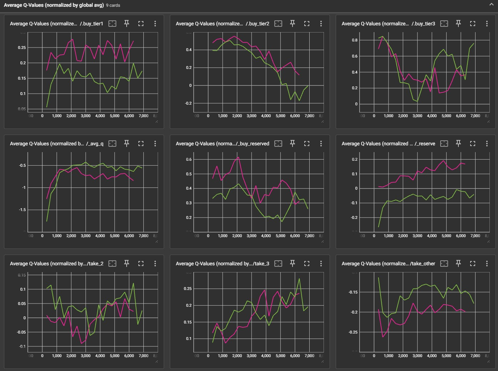
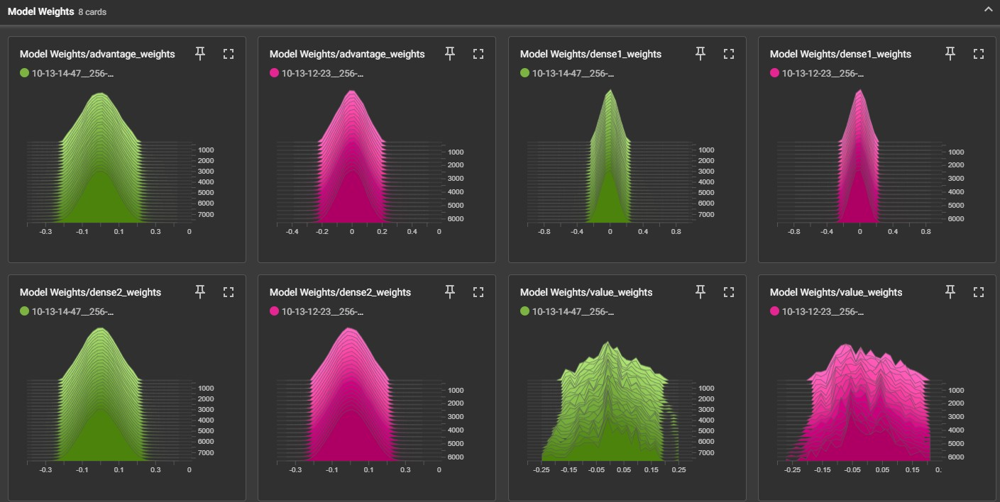

# Splendor-AI

Welcome to the Splendor-AI repository! This project allows you to build and play versus a superhuman AI in the long-term planning board game Splendor, which won Board Game of the Year in 2014.  

I'm quite proud of this project as there's a long list of repos and papers which have attempted to make this agent but almost all fail and none have surpassed human performance.  I was able to get there through Double-DQN with PER + dueling heads, and an extremely tuned state/action space.  Splendor has an unmanageable action space by default, so my key contribution is what I chose to keep in the action space and what to apply heuristics to (note that I kept this a pure RL approach: absolutely no intelligent logic or calculations are injected into the model[^1][^4]).

## Play now at https://breckemert.github.io/Splendor-Webapp/

## Overview

- **Performance**: Learns to play Splendor just above the upper level of skilled human performance.  While the average BoardGameArena game length is 28 moves, this agent currently plays games averaging 25 moves.[^2][^3]  The rendered games show the agent building up resources towards high point:gem ratio cards, blocking opponent goals, and thinking long-term.
- **Visualization**: Generates frames of the games at each state along with card counts and move descriptions.
- **Modular Design**: I built this in a fully object-oriented, clean and commented way.  Although the overall game is too complex to fully redo, you should have an easy time changing any specific set of features you want.

<p align="center">
  
  
</p>

## Reinforcement Learning Overview

This agent uses a Double Dueling Deep Q-Network (Dueling DDQN).  It's an expansion of Q-learning that helps with overestimation bias and stabilizes the q-values by having a lagged target network derived from the policy model to estimate the q-values.  This is a temporal-difference (TD) method, which means it relies on estimating the future reward, estimating again at the next step, and comparing its prediction with what it ended up seeing in order to "bootstrap" learn how to value actions.  And this makes it difficult to learn Splendor, because Splendor is a sticky game.  Once you commit to actions, there is no turning around.  The gem supply is extremely limited and the reserved cards stay in your inventory forever.  This makes the model correlate any positive reward it saw with any junk that was in its state, and unable to figure out how to avoid the junk in the first place.

Here are some core lessons for anybody curious about how to do a similar project:
- Correlate the sticky, dead-end states with negative rewards however you can.  If your model has some gems that no longer help it buy something on the board, then a negative reward in this scenario will make the model avoid actions that tend to lead into this state, regardless of being provided with an explicit path on how to get there.  It basically learns "If I take gems now, my state will start looking like one I received a lot of negative reward in, so I'll avoid it".
- Take the time to plan out the perfect way to deal with things that are hard to model first.  A lot of my initial work in this project was dealing with how to take gems.  If you enumerate the possibilities there are an obscene amount, so something has to give.  The only question that matters is *which one sends a signal through*?  
- Log everything in TensorBoard.  All of it.  It's extremely not hard to do compared to all the time it will save you in visualizing how and where to change every aspect of your RL.
<p align="center">
  
  
</p>

## Getting Started

**Note:** I use tf-gpu, docker, and devcontainer.  Getting tf-gpu to work can be a struggle the first time, but following this matrix is the quickest way to stay on track.  From experience, I wouldn't mess with install guides without having this as the primary resource.  https://www.tensorflow.org/install/source#gpu  
| Version           | Python version | Compiler      | Build tools  | cuDNN | CUDA |
|-------------------|----------------|---------------|--------------|-------|------|
| tensorflow-2.16.1 | 3.9–3.12       | Clang 17.0.6  | Bazel 6.5.0  | 8.9   | 12.3 |

Next, open VSCode and open the project location (Splendor subfolder, **not** the parent git repository).  It should prompt you to reopen in a container, which launches the Docker accordingly.  Hit "Never" on VSCode asking you to open the parent git repository.

#### Playing versus the AI
Running the `play_vs_ai.py` while inside the container will host a local pygame instance.  The model it uses is the current "inference_model.keras" inside of the trained_agents folder.  The more complete version of the game is hosted [here](https://breckemert.github.io/Splendor-Webapp/) in my website, which uses a reasonably difficult model that is still possible to beat.

#### Training

run.py should set up relative pathing cleanly and allow you to choose training, dubbed `ddqn_loop`.  Model hyperparameters are kept to `model.py` with only the layer sizes being customizable from the run.py loop.  run.py and training.py are very simple and short, so I will let their how-to be contained within them if running training interests you.

I have a lot of Tensorboard logs set up which can be run from a separate terminal while you train.  Note that there are tons of different commands I have had to try to get this to work, and sometimes there are port-forwarding-type issues.  You may have to Google around for commands that work for you.  
```bash
tensorboard --logdir=/workspace/RL/saved_files/tensorboard_logs
```

[^1]: When both players are making "intelligent" moves, the state space is literally millions of times smaller.  The complexity comes from the fact that early on in the training process the models don't know what to buy and cap-out their inventory, and are then forced to moves that give basically no signal (longer horizons before they see any reward because the moves make less progress towards being able to buy a card) or truly get stuck in a dead game state.  The only logic applied is that I lined this up with what the model actually wanted to do.  So say if the model wanted to take some ideal set of gems but that move was illegal because of the legal move mask, I simply looked at that and modified the move such that the model's inventory becomes more like what it wants.  Specifically: when a model reaches 10 gems and cannot take any more, it must discard at a 1:1 ratio any gems it took.  This opens up the model to have to choose between a lot of things.  So I simply line up the end result with as close as it can get to what it wanted if there were no illegal moves.

[^2]: Statistics taken directly from BGA.  There is a screenshot of the statistics as I found them in 'reports/figures/avg_game_length.png' where the average game length can be calculated from.

[^3]: Average game length during training self-play appears longer (~29 moves) because truly optimal play involves hoarding and blocking, artificially making the games slower compared to how most humans play.  The reported 27-move average is on a sample size of 50 games played on BoardGameArena (48 wins and 2 losses).

[^4]: There are extremely hard-coded rewards in the `RewardEngine`, but these end up in about the same game lengths - they just get there almost instantly during training.  Anything done there was just a fun extra step after building the webapp to get to code some math and actually see if I can model the game's underlying ground truth.
